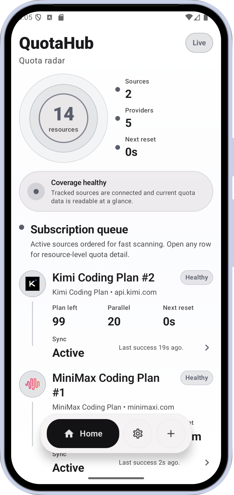
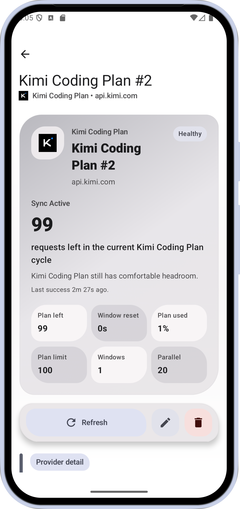
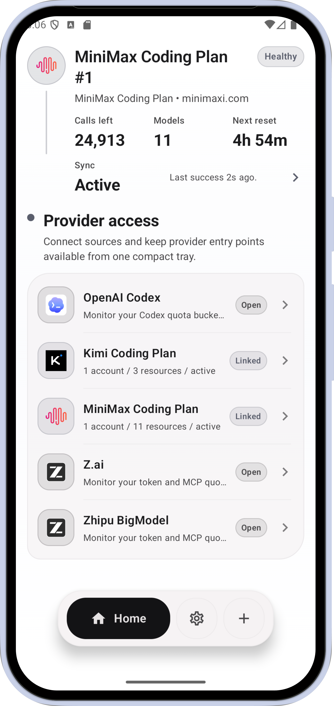
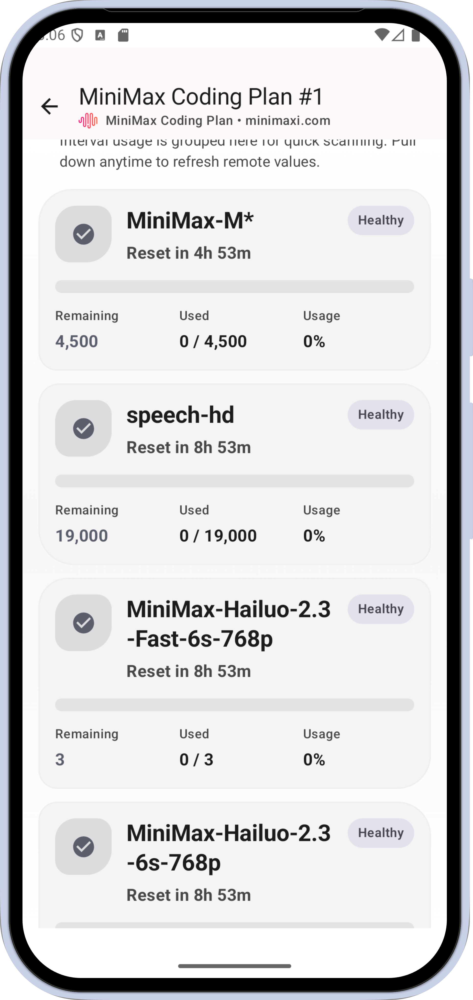
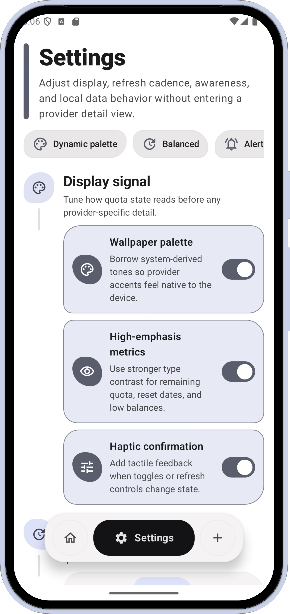
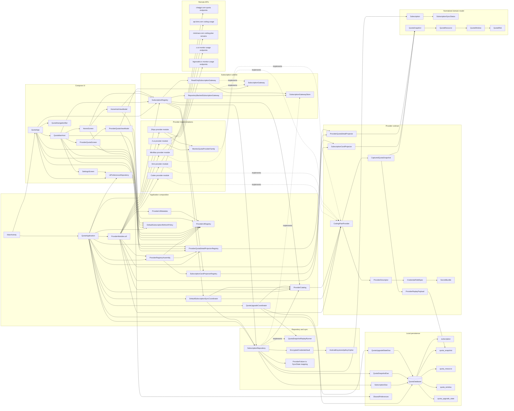

# QuotaHub

QuotaHub is an Android quota dashboard built with Jetpack Compose. It is designed to help users track remaining AI subscription quotas, inspect model-level limits, and monitor upcoming reset windows from a single app. The current codebase integrates multiple providers, including `OpenAI Codex`, `Kimi Coding Plan`, `MiniMax Coding Plan`, `Z.ai`, and `Zhipu BigModel`.

<p align="center">
  
  
  
  
  
</p>

## Current Features

- Add Codex, Kimi, MiniMax, Z.ai, or Zhipu subscriptions from the app and validate credentials before saving them.
- Show connected subscriptions on the home screen with model counts, remaining calls, risk level, and nearest reset time.
- Open a subscription detail page to inspect model-level quota data, pull to refresh, rename the subscription, or disconnect it.
- Cache subscriptions and the latest quota snapshot locally with Room.
- Persist provider-specific raw payloads so normalized quota snapshots can be replayed after schema upgrades.
- Persist UI preferences for `High-emphasis metrics` and `Haptic confirmation`.

## Tech Stack

- Kotlin 2.3.10
- Android Gradle Plugin 9.1.1
- Jetpack Compose + Material 3
- Navigation Compose
- ViewModel + Kotlin Flow
- Room
- Retrofit + OkHttp + Kotlinx Serialization

## Requirements

- A recent stable Android Studio version
- JDK 11
- Android SDK 36
- A device or emulator running at least Android 13 (`minSdk 33`)

## Run Locally

```bash
./gradlew assembleDebug
```

To install the debug build on a connected device:

```bash
./gradlew installDebug
```

After launching the app:

1. Tap the add action on the home screen.
2. Choose `OpenAI Codex`, `Kimi Coding Plan`, `MiniMax Coding Plan`, `Z.ai`, or `Zhipu BigModel`.
3. Enter the required credentials and optionally set a custom title.
4. Save the subscription to validate credentials and fetch the initial quota snapshot.

## CI/CD

GitHub Actions builds the project in two paths:

- `Android Debug CI` runs on every push and pull request, executes
  `testDebugUnitTest`, builds the debug APK, and uploads it as an artifact.
- `Android Release CI` runs manually or on `v*` tags, executes
  `testDebugUnitTest`, builds the signed release APK with R8 and resource
  shrinking enabled, uploads both the APK and R8 mapping file, and creates a
  GitHub Release when triggered by a tag.

The release workflow expects these repository secrets:

- `ANDROID_KEYSTORE_BASE64`
- `ANDROID_KEYSTORE_PASSWORD`
- `ANDROID_KEY_ALIAS`
- `ANDROID_KEY_PASSWORD`

To prepare the current release key for `ANDROID_KEYSTORE_BASE64`:

```bash
base64 -w 0 /home/luren/Android/MyBuildKeys/Skxkey.jks
```

## Architecture Overview

The app is organized around one provider registry, one repository-backed quota
store, and provider modules that supply API clients plus UI projection logic.



- `QuotaApplication` owns runtime assembly: Room, repositories, provider modules, registries, refresh policy, sync coordinator, and replay coordinator.
- `HomeHubViewModel` observes `SubscriptionRegistry.snapshots`, while `ProviderQuotaViewModel` works through a `SubscriptionGateway` selected by provider support.
- `SubscriptionRegistry` turns repository flows into card projections and returns either `RepositoryBackedSubscriptionGateway` or `ReadOnlySubscriptionGateway`.
- `DefaultSubscriptionSyncCoordinator` is the only path that performs remote refresh or credential revalidation; it calls providers, then asks the repository to cache snapshots and sync state.
- `SubscriptionRepository` owns local persistence, encrypted credential storage, normalized snapshot caching, replay payload persistence, and sync failure mapping.
- `ProviderModule` wires each provider into the shared catalog with its API client, credential descriptor, card projector, detail projector, and replay contract.
- `QuotaUpgradeCoordinator` compares provider replay fingerprints and replays stored raw payloads through `QuotaSnapshotReplayRunner` when normalizers change.

This structure is already used for multi-provider support. Adding a new provider mainly requires a new provider definition, API client, normalization logic, and provider-specific UI projector implementation.

## Implementation Status

- `OpenAI Codex`, `Kimi`, `MiniMax`, `Z.ai`, and `Zhipu` are currently integrated.
- The codebase includes unit tests for repository, gateway, upgrade replay, and provider-specific normalization/projector logic, but it still lacks broader end-to-end coverage.
- Part of the `Settings` screen is still UI-only placeholder behavior and does not fully persist or drive background update policies.

## Security and Release Notes

Based on the current source code:

- Provider credentials are encrypted before being persisted in the local Room
  database using an Android Keystore-backed AES/GCM cipher.
- Network clients use redacted HTTP logging: debug builds keep
  `HttpLoggingInterceptor.Level.BASIC` for request visibility, while release
  builds disable interceptor output. Sensitive headers such as
  `Authorization`, cookies, and account identifiers are redacted before logging.

## Possible Next Steps

- Add support for more AI providers.
- Add scheduled refresh and system notifications.
- Write unit tests for the repository, gateway, and quota calculation logic.
- Add import/export or sync support.

## License

This project is licensed under the [Apache License 2.0](LICENSE).

Third-party provider names, logos, and other brand identifiers remain subject
to their respective owners' rights and are not granted under this repository's
open-source license. See [NOTICE](NOTICE) and [TRADEMARKS.md](TRADEMARKS.md)
for the redistribution boundary.
